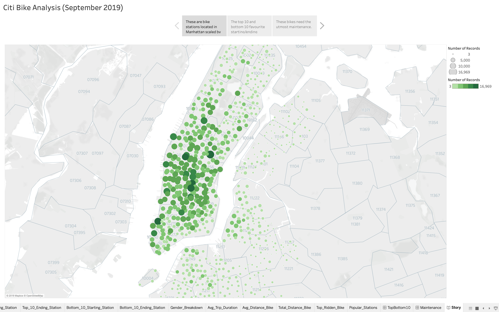
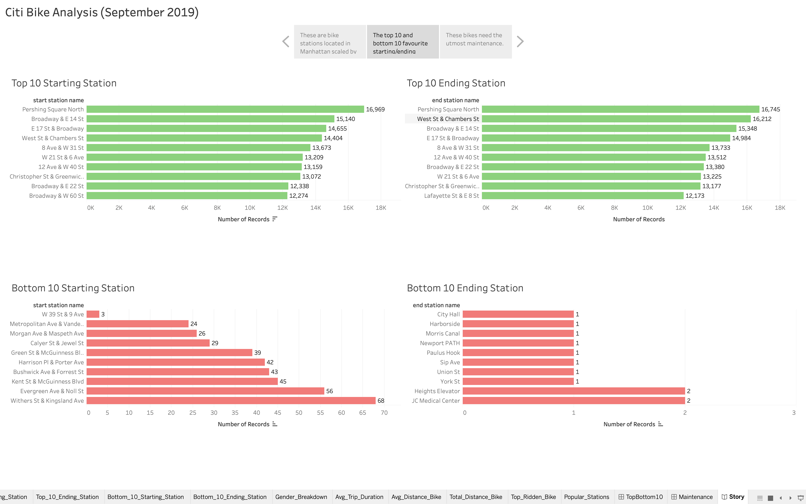
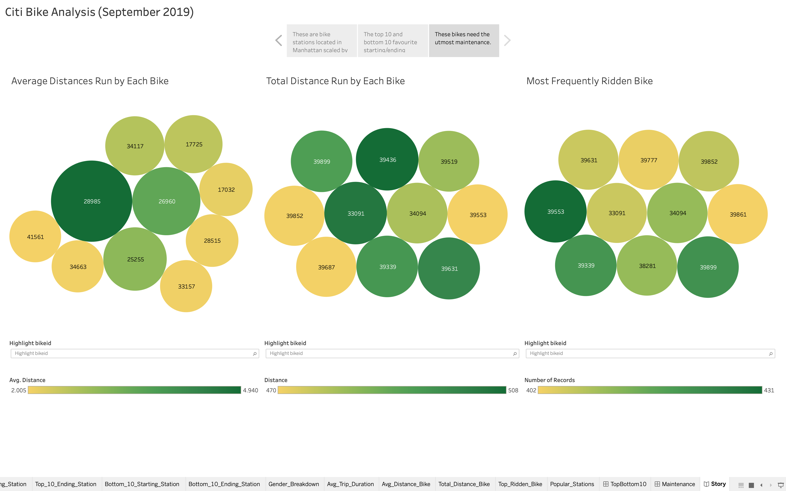

# CitiBike Analysis (September 2019)
This analysis utilizes Tableau Public and data acquired from [CitiBikeNYC](https://www.citibikenyc.com/system-data) to study various phenomena of rental bike ridership of September 2019. The story consists of three interactive dashboards:
* A city map with popular bike stations
* Top/bottom 10 starting/ending stations
* Bikes that need the utmost maintenance

This story can be accessed by clicking [here](https://public.tableau.com/views/A15_CitiBike_Analysis/Story?:display_count=y&:origin=viz_share_link). The source data can be found [here](https://s3.amazonaws.com/tripdata/201909-citibike-tripdata.csv.zip).

The following screenshots showcase the story:

